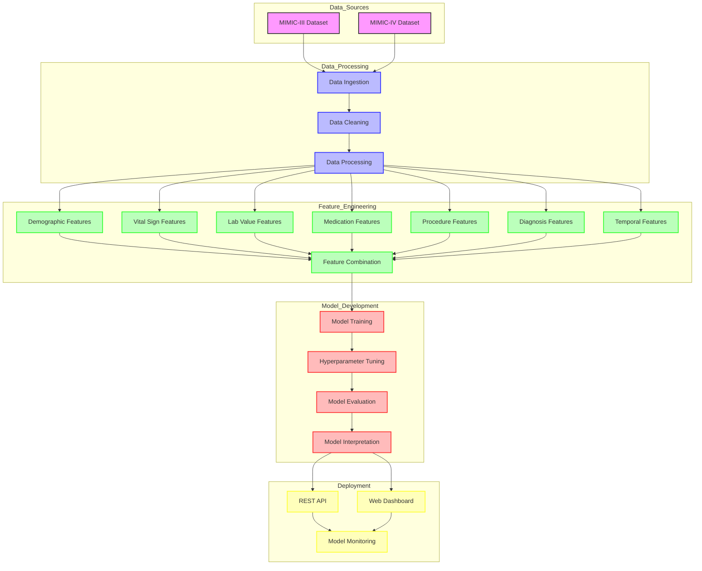

# MIMIC Demo Project Architecture

This document provides an overview of the project architecture and data flow.

## Architecture Diagram

## Component Descriptions

### Data Sources
- **MIMIC-III Dataset**: Medical Information Mart for Intensive Care III - a large, freely-available database comprising de-identified health-related data.
- **MIMIC-IV Dataset**: The updated version of MIMIC-III with additional data types and improved structure.

### Data Processing
- **Data Ingestion**: Scripts to load and parse raw MIMIC data files.
- **Data Cleaning**: Handling missing values, outliers, and inconsistencies in the raw data.
- **Data Processing**: Transforming and structuring the data for feature extraction.

### Feature Engineering
- **Demographic Features**: Patient age, gender, ethnicity, etc.
- **Vital Sign Features**: Heart rate, blood pressure, temperature, etc.
- **Lab Value Features**: Blood tests, chemistry panels, etc.
- **Medication Features**: Drugs administered, dosages, etc.
- **Procedure Features**: Medical procedures performed during the stay.
- **Diagnosis Features**: ICD-9/10 codes and clinical categories.
- **Temporal Features**: Time-based patterns and sequences.
- **Feature Combination**: Integration of all feature types into a unified dataset.

### Model Development
- **Model Training**: Training machine learning models on the prepared features.
- **Hyperparameter Tuning**: Optimising model parameters for best performance.
- **Model Evaluation**: Assessing model performance using appropriate metrics.
- **Model Interpretation**: Explaining model predictions using SHAP values and other techniques.

### Deployment
- **REST API**: FastAPI service for real-time predictions.
- **Web Dashboard**: Interactive visualisation and exploration of model predictions.
- **Model Monitoring**: Tracking model performance and data drift over time.

## Key Files and Directories

- `src/data/`: Data processing scripts
- `src/features/`: Feature engineering code
- `src/models/`: Model implementation and training
- `src/utils/`: Utility functions and configuration
- `api/`: API implementation
- `dashboard/`: Dashboard implementation
- `configs/`: Configuration files
- `tests/`: Unit and integration tests

## Configuration Impact

The project's behaviour can be significantly modified through configuration settings:

- **Feature Engineering**: Changing `window_hours` in `config.yaml` under `features.vitals` directly affects the time window used for vital sign aggregation in `feature_extractors.py`.
- **Model Selection**: The `algorithms` setting under each model type in `config.yaml` determines which ML algorithms are used.
- **Evaluation Metrics**: The metrics used for model evaluation can be configured in the `evaluation` section.
- **API Settings**: Host, port, and debug settings for the API can be modified in the configuration.
